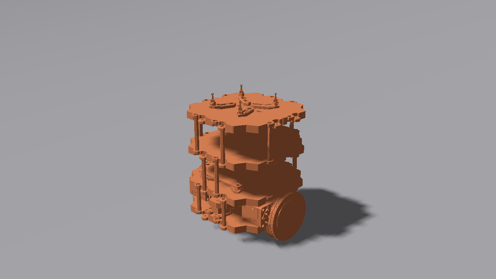
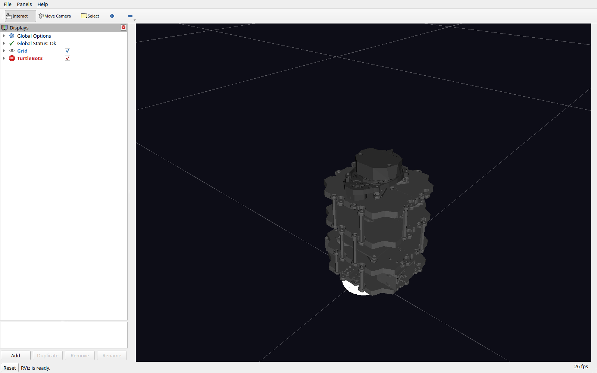

# ros2-nav2-sim

ROS 2 Jazzy + Gazebo Harmonic navigation simulation. Teleoperate a TurtleBot3, build a map with SLAM Toolbox, then run autonomous waypoint missions with Nav2. 

## Preview

*TurtleBot3 Burger rendered by Gazebo Harmonic's rendering engine. A screenshot from a live simulator run is still to come; it must be captured on a machine with working network transport.*

*The TurtleBot3 model in a live RViz2 session. A full mapping screenshot (live map plus laser scan from SLAM Toolbox) still needs to be captured during a mapping run.*

## What it does

- `sim.launch.py`: spawns a TurtleBot3 Burger in a Gazebo Harmonic world
- `mapping.launch.py`: runs SLAM Toolbox to build a 2D map while teleoperating
- `nav2.launch.py`: runs the Nav2 stack on a saved map for autonomous navigation

## Setup

Pick one path:

- **Mac + UTM VM (recommended):** free Ubuntu 24.04 virtual machine — `docs/setup-mac.md`
- **Remote Linux over SSH:** cloud VM, Foxglove for visualization — `docs/setup-remote.md`
- **Native Ubuntu 24.04 / WSL2:** `docs/setup-ubuntu.md`
- **Docker (fallback):** `docs/setup-docker.md` — GUIs don't work on Apple Silicon

## Run it

1. **Drive** — launch the sim, steer the TurtleBot3 with the keyboard
2. **Map** — run SLAM Toolbox, drive around, save the map
3. **Navigate** — launch Nav2 on the saved map, send goals in RViz
4. **Demo** — record a screen capture, fill in `docs/writeup-template.md`

Full step-by-step checklist: `docs/checklist.md`

## Stack

ROS 2 Jazzy (LTS), Gazebo Harmonic, TurtleBot3, SLAM Toolbox, Nav2. All open source.

## Links

- ROS 2 Jazzy install docs: https://docs.ros.org/en/jazzy/Installation/Ubuntu-Install-Debs.html
- Gazebo Harmonic install docs: https://gazebosim.org/docs/harmonic/install_ubuntu/
- Nav2 docs: https://docs.nav2.org/
